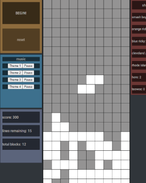

## Description
This project aims to recreate the classic game of Tetris. The goal of the game is to complete the given number of lines while avoiding stacking any blocks up to the top of the play field. Blocks can be flipped clockwise through tapping the shift key, and moved upon the left-right axis with the arrow keys. The game includes a score counter, (25 points per block, and 100 per completed line) and tracks how many instances of each shape has appeared. Complete with the original music files. 

## Screens

## Game Controls
Space bar : flips blocks
Arrow keys(left & right) : moves blocks left & right

## Game Link
https://pages.git.generalassemb.ly/loganjm/tetris/

## Future Enhancements
* The game requires difficult mode options, to select first the line completion requirements, then speed preferences
* High score tracking
* Diagonal movement

### Technologies used
* javaScript
* html 
* css

## Controls
* Shift / space bar flips blocks
* Left & right arrow keys move left & right, or the A & D keys.
